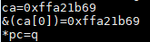

# 第003课_linux入门命令

# 第003课_linux入门命令

# 001节_linux命令入门演示

```
问题：除了图形界面，ubuntu下面有没有其他方式也可以创建目录。创建文件？
回答：通过Linux命令

linux命令：是每个linux学习者必须掌握的基础知识，入门阶段掌握常用的一些命令即可。

pwd     ：显示当前所在目录
ls        ：显示当前目录下的文件
cd       ：切换路径
            cd ..返回到上一级路径
mkdir  ：新建目录
rmdir   ：删除目录
touch  ：:新建目录
cp      ：复制目录
rm      ：删除目录
cat     ：将文件内容显示到终端中
clear   ：清除屏幕的显示内容
```

# 002节_shell命令解析功能说明

```
在shell中输入字符串并回车的过程：
1.shell根据第1个字符串去环境变量PATH所指定的目录中找到同名的应用程序
2.然后执行它

我们可以设置PATH环境变量添加我们的目录
export PATH=$PATH:/my/dir

command not found的原因：
1.PATH所指定的目录中午次程序
2.它不是可执行的程序
```




# 003节_linux命令提示符和linux命令格式

```
命令提示符表示了
1.当前登录的用户
2.用户当前所在的路径
```

如图：


# 004节_linux常用命令引入

```
linux命令的格式
    命令 【选项】 【参数】
举例：
    ls
    ls -l
    ls -l /home

1)命令这一部分肯定是存在
2）选项和参数不一定存在，可有可无
    选项和参数取决于你使用该命令实现的具体目的。
3）选项是以“-”来指明的。
4）命令、选项、参数之间是以空格来隔开的
    一个或多个空格都视为1个空格。
如：ls -l /home   与 ls    -l     /home    目的是一样的。
5）完成linux命令输入后，按下enter键，即可执行该命令。
//------------------------------------------------
如ls命令有选项-l，那么ls到底有哪些选项呢？可以通过man ls来查看、
ls命令的选项有很多，入门阶段先掌握ls命令的-l，-a，-h等常用选项。
在后面视频中，也是先介绍linux基础命令（pwd，cd,ls等常用选项）
```

# 005节_pwd命令 _独家记忆方法

```
pwd 打印当前所在的路径
```

如图：


# 006、7、8节_cd命令讲解1 _独家记忆方法

```
cd：切换路径
    cd ~切换到当前用户的家目录
    cd .切换到当前路径
    cd ..切换到上一级路径
    cd ../..切换到上上级路径（其中，在linux中路径分隔符为斜杠/）
    cd -切换到上一次路径
```

如图：


# 009节_linux基础知识_linux目录结构介绍

```
linux目录结构
/                   --------------------------------------根目录/
|-----------bin  ---------------------------------------/bin
|-----------home -------------------------------------/home
        |------book ---------------------------------------/home/book
        |------Guest ---------------------------------------/home/Quest
|-----------usr -------------------------------------/usr
        |------lib ---------------------------------------/usr/lib
        |------bin ---------------------------------------/usr/bin
```

# 010节_linux基础知识_绝对路径和相对路径

```
举例：
/home/book  是绝对路径
相对路径一般是以.和..来构成
1）
当前路径为/bin，然后./pwd就是执行了/bin/pwd
2)
当前路径为/home/book/Desktop
然后cd ../Music就到达/home/book/Music
cd ../..就到达/home

小节：以./或../开头为相对路径
```

# 011节_cd命令讲解2_注意事项：

```
1）可以使用ls命令某个路径下的所有内容。
2）多使用table键
```

# 012节_ls命令独家记忆方法

```
ls：列出目录内容
cd切换路径，然后在使用ls查看目录内容

举例：
    命令  【选项】 【参数】

1）ls
直接ls，显示当前路径内容

2）ls 目录名
如：ls /home，则指定显示/home的内容
如：ls ~      ，则显示/home/book的内容

3）ls 选项
或：ls 选项 目录名
常用选项：
    -l（long的缩写），显示目下文件的更详细的信息（文件权限，文件最后修改时间、文件大小）
    -a（all的缩写），显示了隐藏文件
    -h(human-able的缩写)，将文件大小以K(KB)、M(MB)、G(GB)
```

# 013_目录操作mkdir和mdir_独家记忆方法

```
mkdir：创建目录
    命令  【命令】    【选项】

举例：
1）mkdir 目录
mkdir dir0 创建dir0目录

2）mkdir -p 父目录/子目录
mkdir -p dir1/dir2
-p(parents的缩写)
连续创建多级目录（父目录和子目录），如父目录不在，则需要加入-p参数。

rmdir ：删除目录
举例：
1）rmdir 目录名
注意：rmdir不能删除非空目录（非空目录：该目录下面有子目录或者文件）
```

如图：


# 014节_文件操作touch_mv_cp_rm

```
touch：创建文件
    touch 文件名
举例：
touch file1 
    gedit file1：编辑file1文件内容

注意：
1）同一目录不能创建同名文件    
2）linux文件名是区分大小写的，如file1和File1是不同文件
    这一点跟windows不同。
```

### mv（move的缩写），修改文件（目录）名、移动路径

```
mv 旧文件名 新文件名    ====》修改文件名
如：mv file1 file2将当前目录下的file1改为file2

mv 旧目录名 新目录名    ====》修改目录名
如：mv dir1 dir2将当前目录下的dir1改为dir2

mv 文件名    目录名      ====》移动路径
如：mv file1 dir2将当前目录下的file1移动到dir2子目录
如：mv file2 ~将当前目录下的file2移动到家目录
如： mv ~/file2 ..将家目录下的file2移动到上一个路径
```

### cp(copy的缩写)：复制文件（目录）

```
1）cp  源文件名    目标文件名
    举例：
    cp file2 file3将当前目录下的文件file1拷贝成file2
    
2）cp    源文件名    目标目录名
    举例：
    cp file2 dir4/将当前目录下的file2拷贝到dir4的子目录
    
3）cp    源目录名    目标目录名
    举例：
    cp -r dir4 dir5复制dir4目录下的所有内容到dir5
    其中：-r参数是递归复制
    
    cp -i file2 dir4如果dir4目录下面有同名的file2，加入-i参数就会要求你确认是否覆盖同名文件
    
    注意：cp的常用参数有：-i,-r,-f,-d等，在后面讲解了linux权限之后，我们会加深cp这个命令的讲解。
```

### rm（remove的缩写）：删除文件（目录）

```
rm  【选项】    【文件名】   【目录名】

常用选项：
    -i（interactive（交互）的缩写），删除文件（目录）之前，要求你确认是否同意删除
    -r（recursive（递归）的缩写），递归删除指定目录下的子目录和文件
    -f（force（强制）的缩写），强制删除

举例：
    rm file2        删除当前目录下的文件file2
    rm -i file3     删除文件file3，删除前要求你确认是否同意删除，其中y表明同一删除，n表明取消删除
    rm -r dir2     删除目录dir2
    rm -ir di4     删除目录dir4 ，删除前要求你确认是否同意删除，其中y表明同一删除，n表明取消删除
    
注意：
    1）删除文件（目录）前，确定该文件（目录）是否可以删除
    2）rm的常用参数有：-i,-r,-f,-d等，在后面讲解了linux权限之后，我们会加深rm这个命令的讲解。
```

如图：


# 015节_文件查看和编辑cat_gedit

```
1）cat 查看文件内容
    cat 文件名
    
举例：
    cat file1               将file1的内容打印到标准输出中（默认标准输出指向终端）
    cat file2 file3        将file2和file3的内容串联并依次全部打印 到标准输出中
    cat -n file2           显示文件内容并在内容签名显示行号。
    
类似的查看命令：more、less、tall等后面讲解
```

如图：


```
2）gedit图形应用程序的编辑器

3）vi 编辑器
```

# 016节_清楚屏幕_clear和reset

```
clear：刷新屏幕，保留历史命令操作记录
    说明：此命令本质上只是让终端先后翻一页
    当向上滚动鼠标时，还是可以看到之前命令的操作记录
    
reset：重新初始化屏幕，清除历史命令操作记录
```

# 017节_帮助信息man_info_help

```
1)man
    ls 常用选项为 -l、-a、-h
    可以通过man  ls来查看这些选项的含义。
    
举例：
    man  man        查看man手册的说明
    man ls            没有指定使用那一页，默认使用第一页
    man 1 ls
    man 1 gcc       gcc是一个应用程序，在linux中一般使用编译器c/c++语言的程序
    open/write/read/close等等都是系统调用
    man 2 open     查看系统调用open的man手册说明
注意：
    man手册的9册内容的侧重点，最好记一下
```

如图：


```
2）info
    如：info ls
```

如图：


```
3）--help
    如：ls --help
```